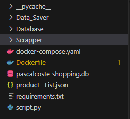
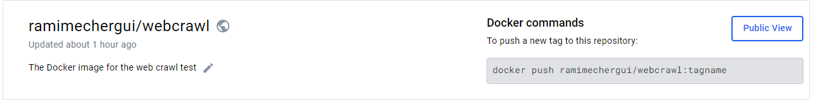
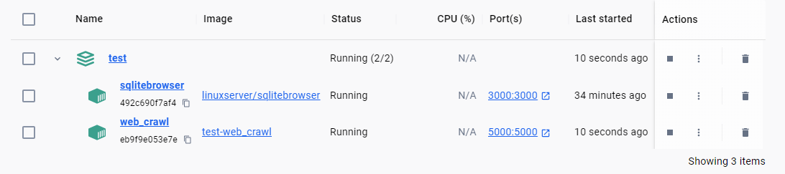
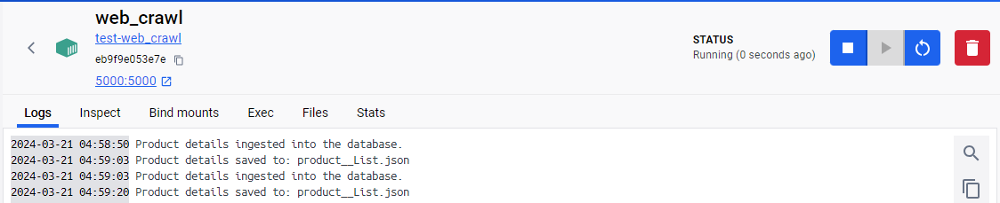

# Web Crawl Test

This project follow this structure

[https://github.com/RamiMechergui/Test.git](https://github.com/RamiMechergui/Test.git)

## Project Structure



- **Data_saver** folder ---> This folder contains a dedicated module to scrape data to a JSON file and ingest it into the database.

- **Database** folder --->Inside this folder, you'll find specific modules to connect to the database and insert data.

- **Scrapper** folder ---> Here reside the specified modules to scrape data from the specified website.

- **script.py** ---> This is the main script responsible for scraping data.

- **requirements.txt** ---> This file contains the specified dependencies required to run the entire project.

- **Dockerfile** ---> Included to containerize the web crawler and database interaction scripts using Docker, ensuring portability and isolation.

- **docker-compose.yml** ---> This file orchestrates the setup of both the web crawler and the database containers.  

## Deployment to DockerHub Registry

Docker image has been pushed to the DockerHub registry


[https://hub.docker.com/repository/docker/ramimechergui/webcrawl/general](https://hub.docker.com/repository/docker/ramimechergui/webcrawl/general)


## Installation

Follow these steps in order to run the project

get your own copy of the project

```git
git clone https://github.com/RamiMechergui/Test.git
```
Starts Docker services defined in docker-compose.yml

```git
docker compose up -d
```
## Containerization

 

```javascript
The project consists of two Docker containers: the "web_crawl" container, which is responsible for scraping data from specified online sources, and storing it into a SQLite database, and the "SQLitebrowser" container, which facilitates the visualization and exploration of the SQLite database contents.
```



```javascript
The web crawl logs delineate the success of data scraping operations and track the sequential progression of data from JSON files to the database, indicating whether each step was completed satisfactorily.
```


## View SQLite Database

```javascript
You may access SQLite tables by navigating to the following link: https://localhost:3000.
From there, you can browse the database and select the mounted database of your choice . 
```


```javascript
 In the section browse database , you can view scrapped database from the specified website.
```

## Tech Stack
**attrs==23.2.0**
**beautifulsoup4==4.12.3**
**bs4==0.0.2**
**certifi==2024.2.2**
**cffi==1.16.0**
**charset-normalizer==3.3.2**
**cloudscraper==1.2.71**
**h11==0.14.0**
**helium==5.0.0**
**idna==3.6**
**lxml==5.1.0**
**outcome==1.3.0.post0**
**pycparser==2.21**
**pyparsing==3.1.2**
**PySocks==1.7.1**
**requests==2.31.0**
**requests-toolbelt==1.0.0**
**selenium==4.18.1**
**sniffio==1.3.1**
**sortedcontainers==2.4.0**
**soupsieve==2.5**
**trio==0.25.0**
**trio-websocket==0.11.1**
**typing_extensions==4.10.0**
**urllib3==2.2.1**
**wsproto==1.2.0**


## Authors
- [@RamiMechergui](https://github.com/RamiMechergui)

